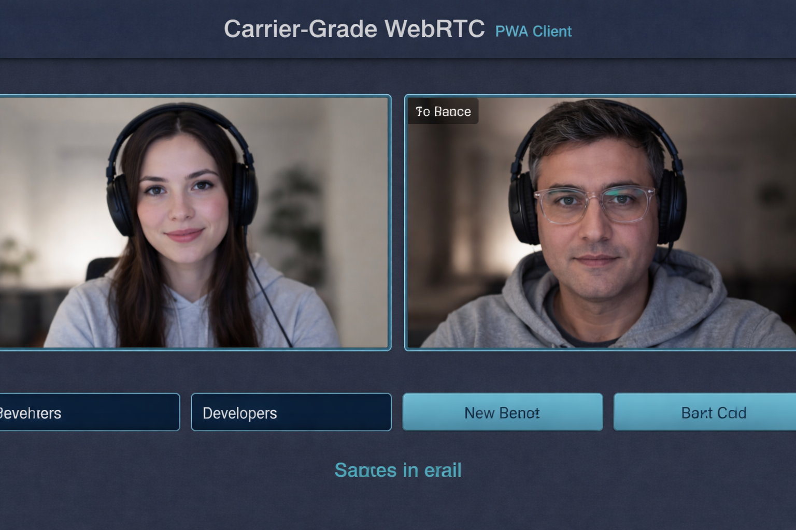
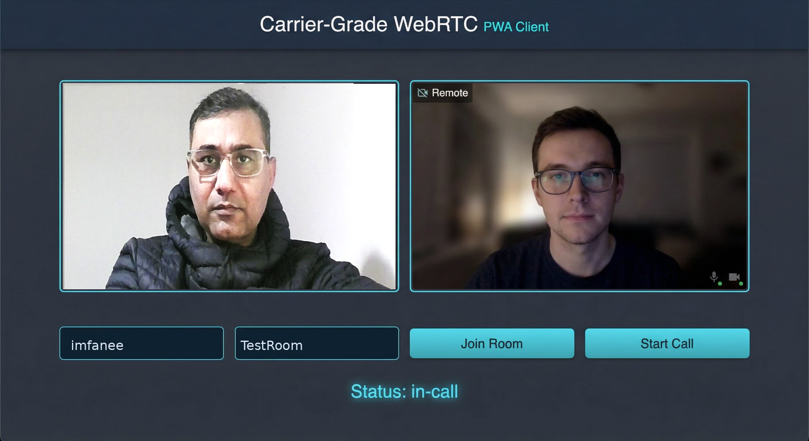

# Carrier-Grade WebRTC Architecture Reference

<!--
  Professional reference implementation for carrier-grade WebRTC signaling and media infrastructure.
  Security-first design with production-quality patterns for telecom and streaming solutions.
  By:- Faisal Hanif | imfanee@gmail.com
-->

A compact, architecturally elegant reference implementation demonstrating carrier-grade WebRTC patterns for real-time communication and streaming. Designed with security-first principles, fault tolerance, and production observability.

---

## Why This Exists

This is a reference implementation to demonstrate failure-domain isolation, non-blocking observability, and security boundaries in WebRTC signaling systems. It's intentionally minimal and designed for learning and architecture review—not as a drop-in production replacement, but as a blueprint for building carrier-grade real-time communication infrastructure.

---

## Overview

This project provides a production-quality blueprint for building scalable WebRTC infrastructure suitable for telecom, connectivity, and streaming use cases. It emphasizes clean architecture, failure isolation, and operational excellence.

---

## Quick Start

```bash
# Start backend services (requires Docker for Redis)
docker-compose up -d redis

# Start Auth service
cd backend && go run ./cmd/auth

# Start Signaling service (separate terminal)
cd backend && go run ./cmd/signaling

# Start client (separate terminal)
cd client && npm install && npm run dev
```

See [Deployment and Testing Guide](docs/Deployment%20and%20Testing.md) for detailed steps.

---

## Screenshots



*Client call UI: local and remote video panels, join/start call controls.*



*Live WebRTC call: local and remote video feeds with active audio/video.*

---

## Project Structure

```
Carrier-Grade-WebRTC/
├── backend/                    # Go microservices
│   ├── cmd/                    # Service entry points
│   ├── internal/               # Shared libraries and patterns
│   └── pkg/                    # Public packages
├── client/                     # NextJS PWA web application
├── docs/                       # Architecture and design documentation
├── examples/                   # Reference implementations
└── docker-compose.yml          # Local development orchestration
```

---

## Documentation

| Document | Description |
|----------|-------------|
| [Architecture Overview](docs/Architecture%20Overview.md) | System design, components, and data flow |
| [Architecture Diagram](docs/Architecture%20Diagram.md) | Visual component and sequence diagrams |
| [System Topology](docs/System%20Topology.md) | Network topology and deployment layout |
| [Failure Domain Breakdown](docs/Failure%20Domain%20Breakdown.md) | Fault isolation and resilience strategy |
| [Service Contracts](docs/Service%20Contracts.md) | API contracts and Go interface definitions |
| [Deployment and Testing](docs/Deployment%20and%20Testing.md) | Step-by-step deployment and validation |
| [Security](SECURITY.md) | Security practices and threat model |

---

## Examples

| Example | Location | Purpose |
|---------|----------|---------|
| Non-blocking Telemetry | `examples/telemetry/` | Async metrics and tracing |
| Circuit Breaker | `examples/circuit_breaker/` | Fault-tolerant downstream calls |
| Load Shedding | `examples/load_shedding/` | Graceful degradation under load |

---

## Services

- **Signaling Service** — WebRTC SDP/ICE signaling over WebSocket
- **Auth Service (reference implementation)** — Token validation and session management
- **Redis Cache** — Session and offer/answer state
- **Health Endpoints** — Liveness, readiness, and dependency checks

---

## Client

The NextJS PWA client (`client/`) connects to the signaling backend, establishes WebRTC peer connections, and supports basic call functionality. See [Client README](client/README.md).

---

## Observability

Structured logging, metrics, and distributed tracing patterns are demonstrated in `examples/observability/`. Integrates with Prometheus and OpenTelemetry-compatible backends.

---

## License

MIT License — See [LICENSE](LICENSE) for details.

---

*By:- Faisal Hanif | imfanee@gmail.com*
