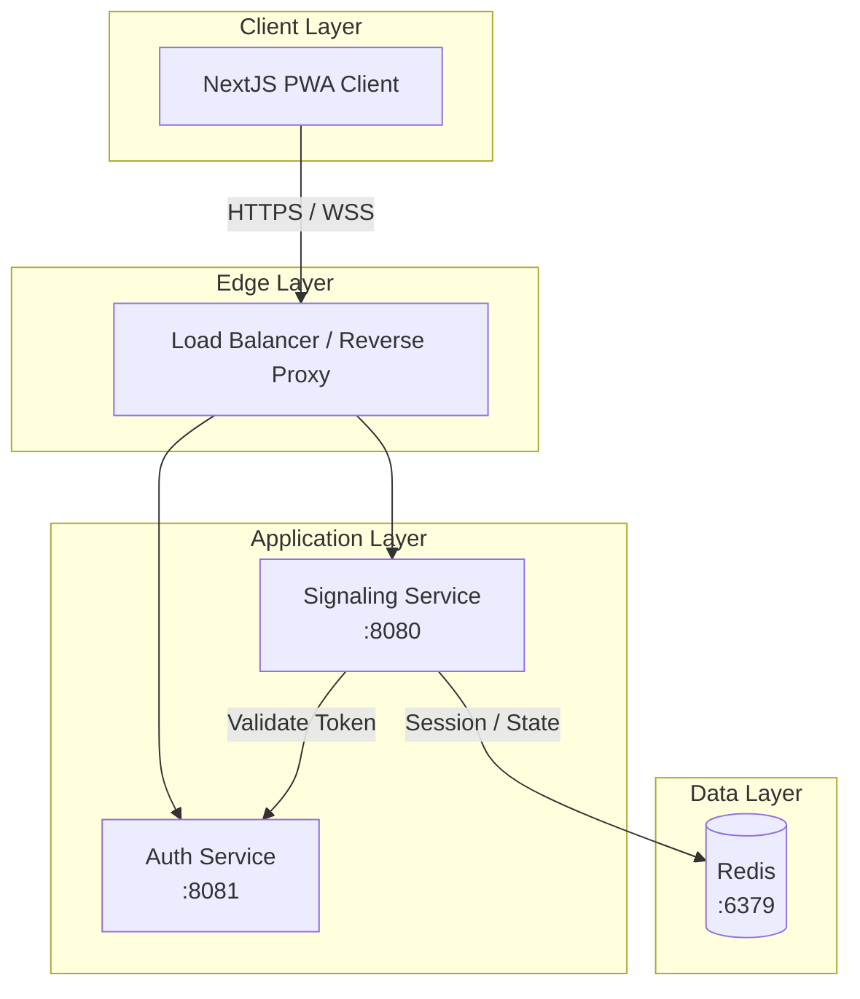
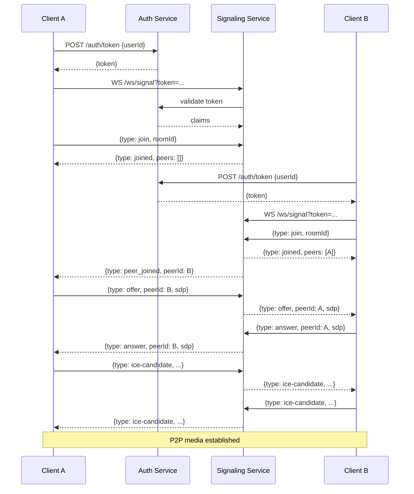
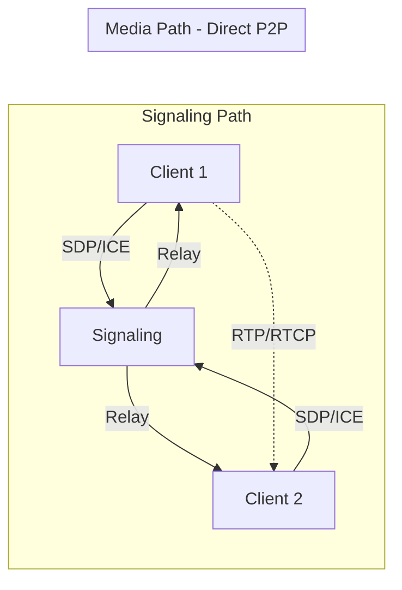

# Architecture Diagram

<!--
  Visual architecture representation for the Carrier-Grade WebRTC reference.
  By:- Faisal Hanif | imfanee@gmail.com
-->

## Component Architecture (Mermaid)

## Sequence: Join and Call

## Data Flow

---

*By:- Faisal Hanif | imfanee@gmail.com*
